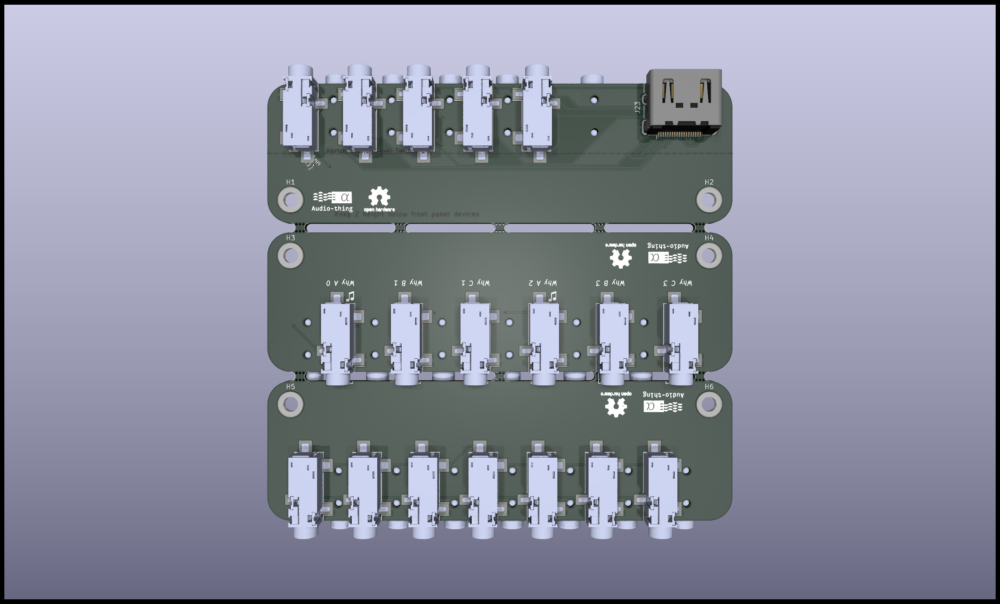

# ONE-8-DM5
Imagine a Doepfer A-180-9, but like, cheaper, and more cowbell.

*Top of board, or is it the side?*

## What problem are you trying to solve?

The [Doepfer A-180-9](https://doepfer.de/A1809.htm) is nifty, slinging 14 signals between racks should't cost $150 though.

~Don't get me wrong, I understand why it costs that and It's a fair price, but we can convince ourselves we can do better.~

The Dual RJ45 cables have been swapped for a single HDMI, just as (if not more) ubiquitous and easy to find high quality cables for a reasonable price. This slings *19* signals (9 Stereo + 1 Mono = 19 Total) over *1* cable.

***But wait, there's more!***

Since the PCB is incredibly simple (and passive) the extra fab space is used for a Quad Stereo Splitter/Joiner and a flexible multiple that can be configured to be a 1-in-10-out (or the reverse).

Estimated Cost for 5 PCBs through JLC, fully populated:
170 x SJ-3524 = $137
5x Molex 2086581001 HDMI = $12.50
Fab = $5.50

Total: $155
Approx. $62 to populate two boards

So for the same price as the Doepfer you get 5 units instead of 2 and a bunch of multiples.

*"Value"*
