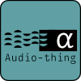

# AudioThings

*I made this for me, maybe you find it helpful?*

>What is the meaning of life? Are we here only to eat hot chip, shitpost, and make the robot have orgasm?
>
>**No!**
>
>*We do audio, we do thing, we do audio things!*

## Navigating this hot mess

This repo is poorly organized and so am I, here are the main non-projet folders.
- [Art](./Art/)
    - Less-than-practical boards that are incomplete.
- [AT-Template](./AT-Template/)
    - KiCad template I've been using to make things.
- [CRIB SHEET](./CRIB%20SHEET/)
    - Things I ~stole~ used for inspiration.
- [Modules](./Modules/)
    - The stuff that's mostly complete
- [OLD](./OLD/)
    - The trashcan, I sometimes use this to store things

## I have opinions and they're loud

Opinions are for suckers, we have convictions (and they're obtuse).

### Maximize Cheap

If we wanted to spend money, we wouldn't pay with our time!

- Boards stay within 100mm x 100mm to get the cheapest per-board costs for small orders
- BOM includes actively produced parts unless there are no other options
- Rely on someone else's scale and use the most common solution in the wrong way

See: [Fab Min-Max Notes](./FAB_NOTES.MD)

### Form Factor Agnostic

- Assume Eurorack
- Assume Backplane
- Assume Stacking
- Assume Standalone

### Your Licensing Model is Bad and You Should Feel Bad

- All work is under copyright, this is not public domain
- Its licensed to you under [Creative Commons Attribution-NonCommercial-ShareAlike 4.0 International](https://creativecommons.org/licenses/by-nc-sa/4.0/)
- If you're not an individual, the words "copyright" and "NonCommercial" are very important.

For how I really feel, see: [LICENSE.MD](./LICENSE.MD)

## Core Features

- Eurorack Compatible
- Backplane preferred but optional
- Daughterboards are assumed (Minium PCB order is 5 after all)

# Navigating this dumpster fire of a repo

This is a hot mess, I apologize for the convienience.

# I took notes here, don't look!

# 
m.2
https://github.com/timonsku/M.2-Card-Footprints/tree/main

# Universal Faceplate

Universal 6mm opening for jacks and pots

11.5mm between board and face

SJ3-350103A 3.5mm Stereo
https://www.digikey.com/en/products/detail/same-sky-formerly-cui-devices/SJ3-350103A/24627980

PTV09 Pots
https://www.bourns.com/docs/Product-Datasheets/PTV09.pdf

